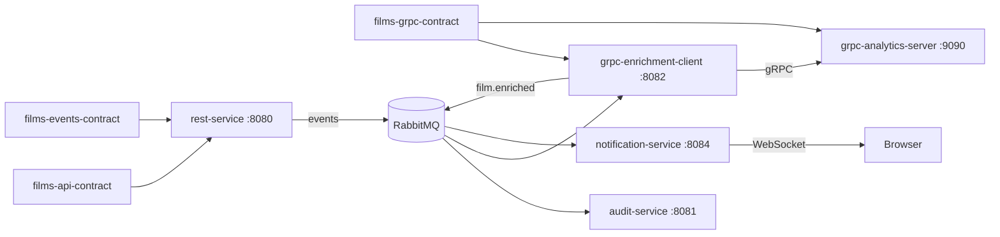

# Отчёт по проекту «Films All»

**Тема:** распределённая система управления каталогом фильмов и режиссёров  
**Стек:** Spring Boot 4, REST, HATEOAS, GraphQL, RabbitMQ, gRPC, WebSocket  
**Расположение проекта:** `/Users/sergey/Documents/films-all`  
**Дата:** 19.06.2026  

---

## Содержание

1. [Введение](#1-введение)
2. [Цель и задачи](#2-цель-и-задачи)
3. [Предметная область](#3-предметная-область)
4. [Архитектура системы](#4-архитектура-системы)
5. [Структура проекта](#5-структура-проекта)
6. [REST, контракт API и Swagger](#6-rest-контракт-api-и-swagger)
7. [HATEOAS — зачем нужен и как реализован](#7-hateoas--зачем-нужен-и-как-реализован)
8. [GraphQL — откуда контракт и зачем он нужен](#8-graphql--откуда-контракт-и-зачем-он-нужен)
9. [События и RabbitMQ](#9-события-и-rabbitmq)
10. [gRPC и обогащение данных](#10-grpc-и-обогащение-данных)
11. [WebSocket и уведомления](#11-websocket-и-уведомления)
12. [Сценарий: создание фильма](#12-сценарий-создание-фильма)
13. [Сборка, запуск и проверка](#13-сборка-запуск-и-проверка)
14. [Как получить картинку из Mermaid-схемы](#14-как-получить-картинку-из-mermaid-схемы)
15. [Выводы](#15-выводы)

---

## 1. Введение

Проект **films-all** — распределённая система для управления каталогом **фильмов и режиссёров**. Каждый фильм имеет уникальный **IMDb ID** в формате `tt1234567`, привязан к одному режиссёру; у режиссёра может быть несколько фильмов.

Главная идея архитектуры — показать, как один бизнес-домен может обслуживаться **несколькими протоколами и стилями интеграции одновременно**:

- **REST** с документацией OpenAPI (Swagger) и гипермедиа-ссылками HATEOAS — для классических HTTP-клиентов;
- **GraphQL** — для клиентов, которым нужны гибкие выборки данных без лишних round-trip запросов;
- **RabbitMQ** — для асинхронной передачи доменных событий между сервисами;
- **gRPC** — для быстрого типизированного вызова между микросервисами;
- **WebSocket** — для доставки уведомлений в браузер в реальном времени.

Отдельно важен принцип **contract-first**: описание API, событий и gRPC вынесено в три независимых Maven-модуля. Сервисы не копируют DTO и строковые константы — они подключают один и тот же jar как зависимость. Это снижает риск рассогласования между producer и consumer.

---

## 2. Цель и задачи

**Цель** — спроектировать и реализовать многомодульное приложение для управления каталогом фильмов, демонстрирующее полный стек технологий современного backend-разработчика.

**Задачи проекта:**

Реализовать REST API с OpenAPI-документацией через модуль `films-api-contract` и сервис `rest-service`. Добавить GraphQL поверх той же бизнес-логики. Организовать асинхронный обмен через RabbitMQ на базе `films-events-contract`. Выделить audit-сервис, который фиксирует все доменные события. Построить цепочку обогащения: событие создания фильма → gRPC-аналитика → новое событие `film.enriched`. Реализовать push-уведомления через WebSocket. Обеспечить единый gRPC-контракт в модуле `films-grpc-contract`.

Все задачи выполнены и проверены живыми HTTP/WebSocket-запросами при запущенных сервисах.

---

## 3. Предметная область

В системе две основные сущности.

**Director (режиссёр)** — человек, снявший один или несколько фильмов. Хранит имя, фамилию, полное имя, национальность, дату рождения, биографию и счётчик фильмов в каталоге.

**Film (фильм)** — основная сущность. Содержит название, IMDb ID, ссылку на режиссёра, жанр, год выхода, язык и описание. Связь «многие к одному»: у каждого фильма один режиссёр, у режиссёра может быть много фильмов.

При старте `rest-service` в память загружаются демо-данные: режиссёры **Кристофер Нолан** и **Квентин Тарантино**, фильмы «Начало», «Тёмный рыцарь», «Криминальное чтивo» с валидными IMDb ID (`tt1375666`, `tt0468569`, `tt0110912`). Данные хранятся in-memory — для демонстрации достаточно оперативной памяти, отдельная СУБД не используется.

---

## 4. Архитектура системы

Система состоит из одного «главного» сервиса и четырёх вспомогательных микросервисов, связанных через RabbitMQ. Три контрактных модуля не запускаются сами — они подключаются как библиотеки.



**rest-service (8080)** — точка входа для клиента. REST, GraphQL, Swagger, публикация событий в RabbitMQ.

**audit-service (8081)** — слушает все события и пишет их в журнал. REST endpoint `GET /api/audit` для просмотра.

**grpc-enrichment-client (8082)** — слушает только `film.created`, вызывает gRPC-сервер аналитики, публикует `film.enriched`.

**grpc-analytics-server (9090 gRPC, 8083 HTTP)** — вычисляет демо-метрики фильма (время, сложность, балл, эпоха).

**notification-service (8084)** — слушает все события и рассылает JSON в WebSocket-клиентам. Есть UI на `/`.

**RabbitMQ** — topic exchange `films.events`, через него проходят все доменные события.

Принцип **loose coupling**: audit, enrichment и notifications не знают о rest-service напрямую — только о формате сообщения из `films-events-contract`. Если RabbitMQ временно недоступен, REST-операция всё равно завершится успешно (fire-and-forget); событие просто не будет доставленo, что логируется.

---

## 5. Структура проекта

Корневой Maven-модуль `films-rest-root` объединяет восемь подмодулей:

```
films-all/
├── films-api-contract/       ← REST-интерфейсы, DTO, Swagger, GraphQL-схема
├── films-events-contract/    ← Java records событий, RoutingKeys
├── films-grpc-contract/      ← film_analytics.proto
├── rest-service/             ← главный сервис (:8080)
├── audit-service/            ← журнал (:8081)
├── grpc-analytics-server/    ← gRPC-сервер (:9090)
├── grpc-enrichment-client/   ← RMQ → gRPC → RMQ (:8082)
└── notification-service/     ← WebSocket (:8084)
```

Контракты собираются первыми (`mvn install`), затем сервисы подтягивают их как зависимости. `rest-service` зависит от `films-api-contract` и `films-events-contract`. `grpc-enrichment-client` и `grpc-analytics-server` — от `films-grpc-contract`. `audit-service` и `notification-service` — только от `films-events-contract`.

Такое разделение повторяет промышленную практику: контракт публикуется как версионируемый артефакт, а команды сервисов согласуют изменения через него, а не через переписку в чате.

---

## 6. REST, контракт API и Swagger

### Зачем нужен отдельный модуль films-api-contract

В типичном монолите контроллер, DTO и Swagger-аннотации лежат в одном модуле. В микросервисной архитектуре (и в данном проекте) API описывается **отдельно от реализации**. Модуль `films-api-contract` содержит:

- интерфейсы `FilmApi` и `DirectorApi` с аннотациями Spring MVC (`@GetMapping`, `@PostMapping` и т.д.) и OpenAPI (`@Operation`, `@Tag`, `@Schema`);
- DTO запросов и ответов (`FilmRequest`, `FilmResponse`, `DirectorRequest` и др.);
- валидацию (`@ValidImdbId` — формат `tt` + 7–8 цифр);
- исключения домена (`ResourceNotFoundException`, `ImdbIdAlreadyExistsException`);
- конфигурацию OpenAPI (`FilmsApiContractConfig` с `@OpenAPIDefinition`);
- **GraphQL-схему** (см. раздел 8).

Сервис `rest-service` содержит классы `FilmController implements FilmApi` и `DirectorController implements DirectorApi`. Контроллер **не объявляет** URL и аннотации заново — он наследует контракт. Если изменится сигнатура метода, компилятор сразу покажет несоответствие.

### Swagger / OpenAPI

Для генерации интерактивной документации в `rest-service` подключён **springdoc-openapi**. Библиотека сканирует classpath, находит аннотации на интерфейсах из контракта и строит спецификацию автоматически.

После запуска доступны:

- **Swagger UI:** http://localhost:8080/swagger-ui/index.html — можно вызывать методы из браузера;
- **OpenAPI JSON:** http://localhost:8080/v3/api-docs — машиночитаемая спецификация.

Swagger нужен прежде всего **людям**: фронтенд-разработчик, тестировщик или другая команда видит все endpoints, параметры, примеры тел запросов и коды ответов без чтения исходного кода. Это реализует паттерн «контракт как документация».

### Обработка ошибок

`GlobalExceptionHandler` в `rest-service` переводит доменные исключения в ответы формата **RFC 7807 Problem Details** (`ErrorResponse`): 404 для «не найдено», 409 для дублирующегося IMDb ID, 400 для ошибок валидации. Клиент получает единообразный JSON независимо от типа ошибки.

---

## 7. HATEOAS — зачем нужен и как реализован

### Проблема «голого» REST

Классический REST возвращает только данные:

```json
{ "id": 1, "title": "Начало", "imdbId": "tt1375666" }
```

Клиент должен **знать заранее**, какие URL существуют: `/api/films/1`, `/api/directors/1`, `/api/films?page=0`. Если API изменится (например, prefix `/v2/`), все клиенты придётся обновлять.

### Идея HATEOAS

**HATEOAS** (Hypermedia as the Engine of Application State) — принцип REST Роя Филдинга: сервер возвращает не только данные, но и **ссылки** на связанные ресурсы и доступные действия. Клиент может «ходить» по API, следуя ссылкам, как по веб-страницам.

Пример ответа с HATEOAS:

```json
{
  "id": 1,
  "title": "Начало",
  "imdbId": "tt1375666",
  "_links": {
    "self": { "href": "http://localhost:8080/api/films/1" },
    "collection": { "href": "http://localhost:8080/api/films" },
    "director": { "href": "http://localhost:8080/api/directors/1" }
  }
}
```

Клиенту не нужно hardcode'ить URL режиссёра — он берёт `director.href` из ответа.

### Реализация в проекте

В Spring HATEOAS это делается через:

1. **`FilmResponse extends RepresentationModel<FilmResponse>`** — DTO ответа оборачивается в модель со ссылками (поэтому это class + Lombok, а не record).

2. **`FilmModelAssembler`** — компонент, который для каждого фильма строит `EntityModel` со ссылками:
   - `self` — на этот фильм;
   - `collection` — на список всех фильмов;
   - `director` — на режиссёра (если есть).

3. **Контроллер** возвращает `EntityModel<FilmResponse>` или `PagedModel<EntityModel<FilmResponse>>`, а не «голый» DTO.

HATEOAS особенно полезен для **публичных API**, где клиенты не контролируются разработчиком backend. Здесь он реализует «полноту» REST по Richardson Maturity Model (уровень 3). GraphQL решает другую задачу (гибкая выборка полей), поэтому в проекте сосуществование обоих подходов — осознанное архитектурное решение.

---

## 8. GraphQL — откуда контракт и зачем он нужен

### Зачем GraphQL, если уже есть REST

REST отдаёт **фиксированную форму** ответа. Если клиенту нужен фильм только с названием и режиссёром, а REST всегда возвращает все поля — трафик и парсинг лишние. Если нужен фильм **и** список всех его режиссёра с биографией — часто требуется **несколько HTTP-запросов** (сначала `/api/films/1`, потом `/api/directors/1`).

**GraphQL** решает обе проблемы:

1. **Клиент сам выбирает поля** — в одном запросе можно запросить только `title` и `director.fullName`.
2. **Вложенные связи разрешаются за один round-trip** — поле `director` у `Film` подгружается резолвером автоматически.

GraphQL не заменяет REST в проекте, а **дополняет** его для сценариев богатых UI (мобильное приложение, админка), где важна гибкость выборки.

### Откуда берётся GraphQL-контракт

GraphQL-контракт — это **схема** (Schema Definition Language, SDL). В проекте она лежит в модуле контракта:

```
films-api-contract/src/main/resources/graphql/schema.graphqls
```

Там описаны типы `Film`, `Director`, `FilmConnection`, входные типы `CreateFilmInput`, `UpdateFilmInput`, корневые `Query` и `Mutation`. Это **единый источник правды** для GraphQL так же, как `FilmApi.java` — для REST.

При сборке файл попадает в jar `films-api-contract`. Сервис `rest-service` подключает этот jar и настраивает DGS (Netflix Domain Graph Service) на поиск схемы:

```properties
dgs.graphql.schema-locations=classpath*:graphql/**/*.graphqls
spring.graphql.graphiql.enabled=true
spring.graphql.path=/graphql
```

То есть **контракт определяет «что можно спросить»**, а **реализация — «как ответить»**.

### Где реализация (не в контракте)

Схема не содержит Java-кода. Реализация — в `rest-service`, пакет `graphql/`:

- **`FilmDataFetcher`**, **`DirectorDataFetcher`** — методы с `@DgsQuery` и `@DgsMutation` привязываются к полям `Query.films`, `Mutation.createFilm` и т.д.;
- **`FilmDirectorDataFetcher`**, **`DirectorFilmsDataFetcher`** — резолверы **вложенных** полей (когда клиент запросил `film { director { ... } }`);
- **`GraphQLExceptionHandler`** — преобразование исключений в GraphQL-ошибки;
- **`GraphQLSecurityConfig`** — настройки безопасности и инструментации.

DataFetcher'ы **не дублируют бизнес-логику** — они вызывают те же `FilmService` и `DirectorService`, что и REST-контроллеры. GraphQL и REST — два «фасада» над одним доменом.

### Пример запроса

```graphql
{
  films(page: 0, size: 3) {
    totalElements
    content {
      title
      imdbId
      director {
        fullName
      }
    }
  }
}
```

Один POST на `/graphql` — и клиент получает фильмы с вложенными режиссёрами. Тестировать удобно через **GraphiQL**: http://localhost:8080/graphiql

### GraphQL vs REST в одном проекте

REST остаётся основным для CRUD с HATEOAS, Swagger-документацией и привычными HTTP-кодами (201 Created, 404 Not Found). GraphQL — для клиентов, которым нужна гибкая выборка. Оба используют один контрактный модуль для описания API (Java-интерфейсы + `.graphqls`), что поддерживает согласованность модели данных.

---

## 9. События и RabbitMQ

### Зачем асинхронность

Когда пользователь создаёт фильм через REST, ему не нужно ждать, пока audit-service запишет событие, gRPC-сервер посчитает метрики и notification-service отправит push. Эти задачи **откладываются** в фон через брокер сообщений.

Преимущества:

- REST-ответ быстрый;
- consumer'ы масштабируются независимо;
- новый consumer (например, email-рассылка) добавляется без изменения rest-service.

### Модуль films-events-contract

Чистая Java-библиотека **без Spring**. Содержит:

- **`FilmEvent`** (sealed interface): `Created`, `Updated`, `Deleted`, `Enriched`;
- **`DirectorEvent`**: `Created`, `Deleted`;
- **`EventMetadata`**: eventId (UUID), timestamp, source, eventType;
- **`EventEnvelope<T>`**: обёртка metadata + payload;
- **`RoutingKeys`**: константы exchange и routing keys.

Sealed interface гарантирует, что switch по типу события **исчерпывающий** — компилятор проверит все варианты.

Exchange: `films.events` (topic). Routing keys: `film.created`, `film.updated`, `film.deleted`, `film.enriched`, `director.created`, `director.deleted`.

### Publisher в rest-service

`FilmEventPublisher` после успешного `create/update/delete` оборачивает событие в `EventEnvelope.wrap(...)` и отправляет через `RabbitTemplate.convertAndSend`. Если RabbitMQ недоступен — ошибка логируется, но HTTP-ответ клиенту уже 201/200.

### Consumer'ы

**audit-service** — очередь `q.audit.events`, binding `#` (все события). Пишет человекочитаемое описание в in-memory журнал.

**grpc-enrichment-client** — очередь `q.enrichment.film-created`, только `film.created`.

**notification-service** — очередь `q.notifications.all`, все события → WebSocket.

Каждый consumer заводит **свою очередь** — это стандартная практика: одна очередь на один сервис, чтобы медленный consumer не блокировал других.

---

## 10. gRPC и обогащение данных

### Зачем gRPC между микросервисами

HTTP/JSON удобен для внешних клиентов, но между сервисами часто используют **gRPC**: бинарный protobuf, HTTP/2, строгий контракт `.proto`, codegen на этапе сборки. Несовместимость версий обнаруживается при компиляции, а не в runtime.

### Модуль films-grpc-contract

Файл `film_analytics.proto` описывает сервис `FilmAnalytics` с одним RPC `AnalyzeFilm`. Maven plugin `protobuf-maven-plugin` + `protoc-gen-grpc-java` генерируют Java-классы: `AnalyzeFilmRequest`, `FilmAnalysisResponse`, `FilmAnalyticsGrpc.FilmAnalyticsBlockingStub` (клиент), `FilmAnalyticsImplBase` (сервер).

И сервер, и клиент зависят от **одного jar** — рассогласования proto невозможны.

### Цепочка enrichment

1. Пользователь создаёт фильм → `film.created` в RabbitMQ.
2. `grpc-enrichment-client` получает событие, формирует `AnalyzeFilmRequest`.
3. Синхронный gRPC-вызов на `localhost:9090` → `grpc-analytics-server`.
4. Сервер возвращает метрики (время, сложность, балл, эпоха — демо-логика по жанру и году).
5. Client публикует `film.enriched` обратно в RabbitMQ.
6. Audit и notifications получают новое событие.

Так показан паттерн **event-driven enrichment**: основная операция не блокируется, обогащение идёт асинхронно, результат снова становится событием.

---

## 11. WebSocket и уведомления

REST и GraphQL — **pull**: клиент сам спрашивает. Для live-ленты («фильм создан», «аналитика готова») нужен **push**.

`notification-service` слушает RabbitMQ и через `NotificationWebSocketHandler` рассылает JSON всем подключённым браузерам.

Endpoint: `ws://localhost:8084/ws/notifications`

UI: http://localhost:8084/ — страница «Центр уведомлений», которая подключается к WebSocket и показывает события в реальном времени.

При создании фильма пользователь видит два уведомления: `film.created` и через ~200 ms `film.enriched` (после gRPC). Дедупликация по `eventId` защищает от повторной доставки RabbitMQ.

WebSocket-контракт отдельным модулем не выносится — формат JSON описан в `EventNotificationListener`. Для текущего масштаба этого достаточно; в production часто выделяют отдельную notification schema.

---

## 12. Сценарий: создание фильма

Пошагово, что происходит при `POST /api/films`:

1. **rest-service** валидирует тело (`@ValidImdbId`, `@NotBlank`), сохраняет фильм в `InMemoryStorage`, пересчитывает `filmsCount` у режиссёра.
2. Контроллер возвращает **201** с HATEOAS-ссылками.
3. `FilmEventPublisher` отправляет `film.created` в exchange `films.events`.
4. **audit-service** записывает: «Создан фильм «...» (IMDb ID: tt...), режиссёр: ...».
5. **grpc-enrichment-client** вызывает gRPC `AnalyzeFilm`, получает метрики, публикует `film.enriched`.
6. **audit-service** дописывает запись об обогащении.
7. **notification-service** шлёт два JSON-сообщения в WebSocket.

Клиент REST этого не видит — он уже получил 201. Вся цепочка асинхронна. Это ключевое свойство event-driven архитектуры.

---

## 13. Сборка, запуск и проверка

**Требования:** Java 21+, Maven, Docker для RabbitMQ.

```bash
docker run -d --name rabbitmq -p 5672:5672 -p 15672:15672 rabbitmq:4-management

cd "/Users/sergey/Documents/films-all"
mvn install -DskipTests

# каждый сервис — в отдельном терминале:
mvn spring-boot:run -pl rest-service
mvn spring-boot:run -pl audit-service
mvn spring-boot:run -pl grpc-analytics-server
mvn spring-boot:run -pl grpc-enrichment-client
mvn spring-boot:run -pl notification-service
```

**Проверка REST:** http://localhost:8080/api/films  
**Swagger:** http://localhost:8080/swagger-ui/index.html  
**GraphiQL:** http://localhost:8080/graphiql  
**Audit:** http://localhost:8081/api/audit  
**Notifications UI:** http://localhost:8084/

**Результаты тестирования:** GET /api/films — 200, POST /api/films — 201, OpenAPI и GraphQL работают. После создания фильма в audit появляются `film.created` и `film.enriched`, в WebSocket — два NOTIFICATION. gRPC-сервер логирует `AnalyzeFilm`.

**Важно:** если RabbitMQ уже использовался с другими приложениями, в брокере могут остаться очереди с устаревшими параметрами (например, другой dead-letter exchange). В этом случае audit-service не создаст очередь — удалите конфликтующие очереди через Management UI или `rabbitmqctl delete_queue q.audit.events` и перезапустите сервис.

**Конвертация отчёта в Word без pandoc:** откройте `.md` в VS Code/Cursor → установите расширение «Markdown PDF» или скопируйте текст в Google Docs / Word (Markdown вставляется с базовым форматированием). Либо установите pandoc: `brew install pandoc`, затем `pandoc "ОТЧЕТ copy.md" -o ОТЧЕТ.docx --toc`.

---

## 14. Как получить картинку из Mermaid-схемы

В отчёте одна архитектурная диаграмма (раздел 4). Чтобы вставить её в Word как PNG:

1. Откройте https://mermaid.live
2. Скопируйте код из блока ` ```mermaid ` (без самих обратных кавычек).
3. Вставьте в редактор — справа появится схема.
4. **Actions → PNG** — скачайте и вставьте в документ.

Альтернатива: скриншот из preview Markdown в IDE.

---

## 15. Выводы

Проект **films-all** демонстрирует полный цикл построения распределённой системы на Spring Boot 4: контракты вынесены в отдельные модули, REST документирован через Swagger, HATEOAS даёт клиенту навигацию по API без hardcoded URL, GraphQL-схема живёт рядом с REST-контрактом в `films-api-contract`, а реализация резолверов — в `rest-service` поверх общей бизнес-логики.

RabbitMQ связывает сервисы слабо: audit, enrichment и notifications не зависят от rest-service напрямую. gRPC обеспечивает типизированный вызов между enrichment-client и analytics-server. WebSocket доставляет результат пользователю без polling.

Система собрана, запущена и проверена end-to-end. Все ключевые компоненты — API-contract (Swagger), event-contract (RabbitMQ), grpc-contract (gRPC) и WebSocket — реализованы и работают совместно.

---

*Конец отчёта*
