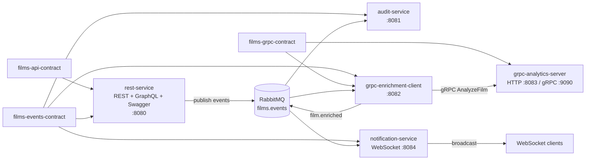
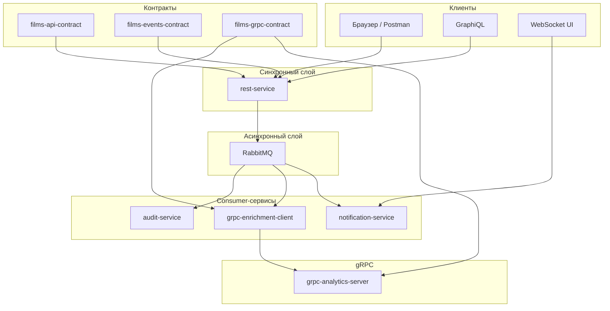
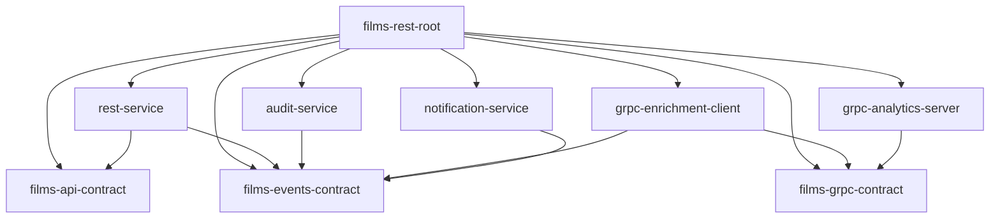
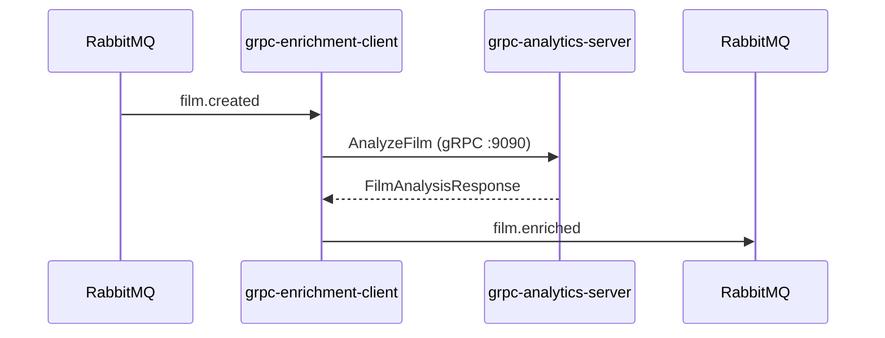
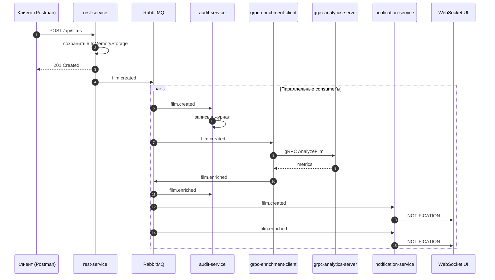
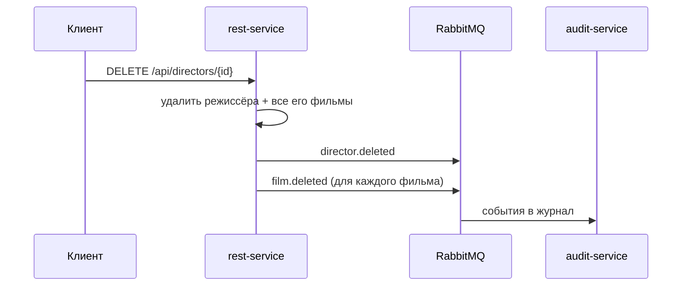
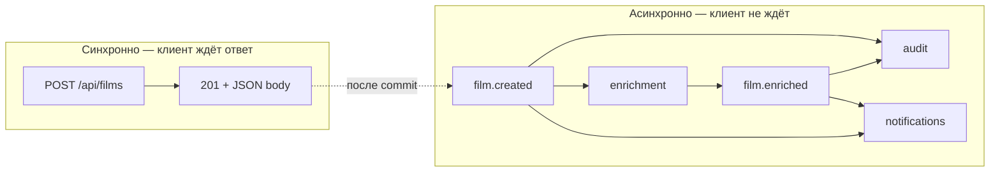

# Отчёт по учебному проекту «Films All»

**Тема:** распределённая система управления каталогом фильмов и режиссёров  
**Стек:** Spring Boot 4, REST, HATEOAS, GraphQL, RabbitMQ, gRPC, WebSocket  
**Р расположение проекта:** `/Users/sergey/Documents/films-all`  
**Дата:** 19.06.2026  

---

## Содержание

1. [Введение](#1-введение)
2. [Цель и задачи проекта](#2-цель-и-задачи-проекта)
3. [Предметная область](#3-предметная-область)
4. [Архитектура системы](#4-архитектура-системы)
5. [Структура Maven-модулей](#5-структура-maven-модулей)
6. [Контракт API (films-api-contract) и Swagger](#6-контракт-api-films-api-contract-и-swagger)
7. [Контракт событий (films-events-contract) и RabbitMQ](#7-контракт-событий-films-events-contract-и-rabbitmq)
8. [Контракт gRPC (films-grpc-contract)](#8-контракт-grpc-films-grpc-contract)
9. [WebSocket и notification-service](#9-websocket-и-notification-service)
10. [Описание микросервисов](#10-описание-микросервисов)
11. [Сценарии взаимодействия (диаграммы последовательности)](#11-сценарии-взаимодействия-диаграммы-последовательности)
12. [Сборка, запуск и инфраструктура](#12-сборка-запуск-и-инфраструктура)
13. [Результаты тестирования](#13-результаты-тестирования)
14. [Как экспортировать диаграммы Mermaid в PNG/PDF](#14-как-экспортировать-диаграммы-mermaid-в-pngpdf)
15. [Выводы](#15-выводы)

---

## 1. Введение

Проект **films-all** — учебная распределённая система, построенная по образцу эталонного проекта преподавателя (Author + Book), но с переходом на предметную область **Director + Film** (режиссёр и фильм). Вместо ISBN книг используется **IMDb ID** в формате `tt1234567`.

Система демонстрирует современный подход к построению микросервисной архитектуры:

- синхронное взаимодействие через **REST API** и **GraphQL**;
- асинхронное взаимодействие через **RabbitMQ** (событийная модель);
- высокопроизводительный межсервисный вызов через **gRPC**;
- push-уведомления клиентам через **WebSocket**.

Ключевая идея — **контракты вынесены в отдельные Maven-модули**, чтобы publisher и consumer зависели от одного и того же кода, а не дублировали DTO и строковые константы.

---

## 2. Цель и задачи проекта

### Цель

Спроектировать и реализовать многомодульное приложение для управления каталогом фильмов с поддержкой REST, GraphQL, асинхронных событий, gRPC-аналитики и real-time уведомлений.

### Задачи

| № | Задача | Реализация |
|---|--------|------------|
| 1 | REST API с документацией | `films-api-contract` + `rest-service` + Swagger UI |
| 2 | GraphQL API | Схема в контракте, резолверы в `rest-service` (DGS) |
| 3 | Асинхронные доменные события | `films-events-contract` + RabbitMQ |
| 4 | Аудит операций | `audit-service` — consumer всех событий |
| 5 | Обогащение данных через gRPC | `grpc-enrichment-client` + `grpc-analytics-server` |
| 6 | Real-time уведомления | `notification-service` + WebSocket |
| 7 | Единый контракт gRPC | `films-grpc-contract` (.proto + generated stubs) |

---

## 3. Предметная область

### Сущности

**Director (режиссёр)** — человек, снявший один или несколько фильмов.

| Поле | Тип | Описание |
|------|-----|----------|
| id | Long | Идентификатор |
| firstName, lastName | String | Имя и фамилия |
| fullName | String | Полное имя |
| nationality | String | Национальность |
| birthDate | LocalDate | Дата рождения |
| bio | String | Биография |
| filmsCount | int | Количество фильмов в каталоге |

**Film (фильм)** — основная сущность каталога.

| Поле | Тип | Описание |
|------|-----|----------|
| id | Long | Идентификатор |
| title | String | Название |
| imdbId | String | IMDb ID (`tt` + 7–8 цифр) |
| director | DirectorResponse | Режиссёр (связь many-to-one) |
| genre | String | Жанр |
| publishedYear | Integer | Год выхода |
| language | String | Язык (ISO 639-1) |
| description | String | Описание |

### Маппинг с эталонным проектом

| Было (Books) | Стало (Films) |
|--------------|---------------|
| Author | Director |
| Book | Film |
| ISBN / isbn | IMDb ID / imdbId |
| books-api-contract | films-api-contract |
| books-events-contract | films-events-contract |
| books-grpc-contract | films-grpc-contract |
| demo-rest | rest-service |
| book.created | film.created |
| AnalyzeBook | AnalyzeFilm |

### Демо-данные (InMemoryStorage)

При старте `rest-service` загружаются:

- **Кристофер Нолан** — «Начало» (`tt1375666`), «Тёмный рыцарь» (`tt0468569`)
- **Квентин Тарантино** — «Криминальное чтиво» (`tt0110912`)

---

## 4. Архитектура системы

### 4.1. Общая схема компонентов



### 4.2. Слои архитектуры



### 4.3. Принципы

1. **Contract-first** — API, события и gRPC описаны в отдельных модулях до реализации.
2. **Loose coupling** — сервисы связаны через брокер сообщений, а не прямыми HTTP-вызовами (кроме gRPC enrichment).
3. **Fire-and-forget для событий** — сбой RabbitMQ не откатывает REST-операцию.
4. **HATEOAS** — REST-ответы содержат гипермедиа-ссылки на связанные ресурсы.

---

## 5. Структура Maven-модулей

Корневой aggregator: `films-rest-root` (версия 1.0).

```
films-all/
├── pom.xml                         # films-rest-root
├── films-api-contract/             # REST + OpenAPI + GraphQL schema
├── films-events-contract/          # Java records, RoutingKeys
├── films-grpc-contract/            # film_analytics.proto
├── rest-service/                   # главный сервис (8080)
├── audit-service/                  # журнал аудита (8081)
├── grpc-analytics-server/          # gRPC сервер (9090)
├── grpc-enrichment-client/         # RMQ → gRPC → RMQ (8082)
└── notification-service/           # RMQ → WebSocket (8084)
```

### Таблица модулей и портов

| Модуль | Тип | HTTP-порт | Прочее |
|--------|-----|-----------|--------|
| films-api-contract | JAR (библиотека) | — | swagger-annotations, GraphQL schema |
| films-events-contract | JAR (библиотека) | — | без Spring |
| films-grpc-contract | JAR (библиотека) | — | protoc + grpc-java |
| rest-service | Spring Boot | **8080** | GraphiQL, Swagger |
| audit-service | Spring Boot | **8081** | GET /api/audit |
| grpc-enrichment-client | Spring Boot | **8082** | gRPC client |
| grpc-analytics-server | Spring Boot | **8083** | gRPC **9090** |
| notification-service | Spring Boot | **8084** | WebSocket /ws/notifications |
| RabbitMQ | Docker | 5672, 15672 | Management UI |

### Граф зависимостей Maven



---

## 6. Контракт API (films-api-contract) и Swagger

### Назначение

Модуль `films-api-contract` — **единый источник правды** для REST API: интерфейсы контроллеров, DTO, валидация, OpenAPI-аннотации, GraphQL-схема.

Сервис `rest-service` **реализует** интерфейсы, но **не дублирует** описание API.

### Ключевые компоненты

| Компонент | Путь / класс | Назначение |
|-----------|--------------|------------|
| FilmApi | `endpoints/FilmApi.java` | CRUD фильмов, GET список с фильтрами |
| DirectorApi | `endpoints/DirectorApi.java` | CRUD режиссёров, GET фильмы режиссёра |
| DTO | `dto/*` | FilmRequest, FilmResponse, DirectorRequest и др. |
| Валидация IMDb | `validation/ValidImdbId`, `ImdbIdValidator` | Regex `^tt\d{7,8}$` |
| OpenAPI | `config/FilmsApiContractConfig.java` | @OpenAPIDefinition, Bearer JWT scheme |
| GraphQL | `resources/graphql/schema.graphqls` | Query, Mutation, типы Film/Director |
| Исключения | `exception/*` | ResourceNotFoundException, ImdbIdAlreadyExistsException |

### REST endpoints

| Метод | URL | Описание |
|-------|-----|----------|
| GET | `/api/films` | Список фильмов (пагинация, фильтры) |
| GET | `/api/films/{id}` | Фильм по ID |
| POST | `/api/films` | Создание фильма |
| PUT | `/api/films/{id}` | Полное обновление |
| PATCH | `/api/films/{id}` | Частичное обновление |
| DELETE | `/api/films/{id}` | Удаление |
| GET | `/api/directors` | Список режиссёров |
| GET | `/api/directors/{id}` | Режиссёр по ID |
| GET | `/api/directors/{id}/films` | Фильмы режиссёра |
| POST/PUT/PATCH/DELETE | `/api/directors/...` | CRUD режиссёров |

### Swagger / OpenAPI

В `rest-service` подключён **springdoc-openapi**:

- **Swagger UI:** http://localhost:8080/swagger-ui/index.html
- **OpenAPI JSON:** http://localhost:8080/v3/api-docs

Аннотации `@Tag`, `@Operation`, `@Schema` на интерфейсах из контракта автоматически попадают в документацию.

### GraphQL

- **Endpoint:** POST http://localhost:8080/graphql
- **GraphiQL:** http://localhost:8080/graphiql

Пример запроса:

```graphql
{
  films(page: 0, size: 5) {
    totalElements
    content {
      title
      imdbId
      director { fullName }
    }
  }
}
```

### HATEOAS

`FilmResponse` и `DirectorResponse` расширяют `RepresentationModel`. Контроллеры используют `FilmModelAssembler` / `DirectorModelAssembler` для добавления ссылок `_links` (self, collection, related).

### Обработка ошибок (RFC 7807)

`GlobalExceptionHandler` в `rest-service` преобразует исключения в `ErrorResponse`:

| Исключение | HTTP |
|------------|------|
| ResourceNotFoundException | 404 |
| ImdbIdAlreadyExistsException | 409 |
| MethodArgumentNotValidException | 400 |

---

## 7. Контракт событий (films-events-contract) и RabbitMQ

### Назначение

Чистая Java-библиотека **без Spring** — sealed interfaces и records для типобезопасных доменных событий.

### Структура контракта

```
films-events-contract/
└── edu/rutmiit/demo/events/
    ├── FilmEvent.java          # Created, Updated, Deleted, Enriched
    ├── DirectorEvent.java      # Created, Deleted
    ├── EventMetadata.java      # eventId, timestamp, source, eventType
    ├── EventEnvelope.java      # metadata + payload
    └── RoutingKeys.java        # exchange, routing keys
```

### FilmEvent (sealed interface)

```java
public sealed interface FilmEvent {
    record Created(Long filmId, String title, String imdbId, ...) implements FilmEvent {}
    record Updated(...) implements FilmEvent {}
    record Deleted(Long filmId, String title) implements FilmEvent {}
    record Enriched(Long filmId, String title, int estimatedReadingMinutes, ...) implements FilmEvent {}
}
```

Sealed interface гарантирует **исчерпывающий pattern matching** в consumer'ах.

### RabbitMQ топология

| Объект | Имя | Тип |
|--------|-----|-----|
| Exchange | `films.events` | topic, durable |
| DLX | `films.events.dlx` | direct |
| Audit queue | `q.audit.events` | binding `#` (все события) |
| Enrichment queue | `q.enrichment.film-created` | binding `film.created` |
| Notifications queue | `q.notifications.all` | binding `#` |

### Routing keys

| Константа | Значение |
|-----------|----------|
| FILM_CREATED | `film.created` |
| FILM_UPDATED | `film.updated` |
| FILM_DELETED | `film.deleted` |
| FILM_ENRICHED | `film.enriched` |
| DIRECTOR_CREATED | `director.created` |
| DIRECTOR_DELETED | `director.deleted` |

### Формат сообщения

```json
{
  "metadata": {
    "eventId": "uuid",
    "timestamp": "2026-06-19T18:36:38Z",
    "source": "rest-service",
    "eventType": "film.created"
  },
  "payload": {
    "filmId": 4,
    "title": "Интерстellar",
    "imdbId": "tt0816692",
    "directorId": 1,
    "directorFullName": "Кристофер Нолан",
    "genre": "Научная фантастика",
    "publishedYear": 2014
  }
}
```

### Publisher

`FilmEventPublisher` и `DirectorEventPublisher` в `rest-service` вызываются **после** успешной бизнес-операции. Паттерн fire-and-forget: ошибка RabbitMQ логируется, но REST-ответ клиенту уже отдан.

---

## 8. Контракт gRPC (films-grpc-contract)

### Назначение

Модуль содержит `.proto`-файл и **автогенерируемые** Java-классы (protoc + protoc-gen-grpc-java). И сервер, и клиент зависят от одного артефакта.

### Файл film_analytics.proto

```protobuf
service FilmAnalytics {
    rpc AnalyzeFilm (AnalyzeFilmRequest) returns (FilmAnalysisResponse);
}

message AnalyzeFilmRequest {
    int64  film_id        = 1;
    string title          = 2;
    string genre          = 3;
    int32  published_year = 4;
    string language       = 5;
    string director_name  = 6;
}

message FilmAnalysisResponse {
    int64  film_id                   = 1;
    int32  estimated_reading_minutes = 2;
    string difficulty_level          = 3;
    double recommendation_score      = 4;
    string era_classification        = 5;
}
```

> *Примечание:* поле `estimated_reading_minutes` унаследовано от book-проекта (время «чтения»); в контексте фильмов семантически ближе к «runtime», но логика analytics-server оставлена как в эталоне.

### Генерация кода

Maven plugin `protobuf-maven-plugin`:

- `compile` — классы сообщений (`AnalyzeFilmRequest`, `FilmAnalysisResponse`)
- `compile-custom` — gRPC stubs (`FilmAnalyticsGrpc.FilmAnalyticsBlockingStub`, `FilmAnalyticsImplBase`)

### Сервер

`grpc-analytics-server` — `FilmAnalyticsServiceImpl extends FilmAnalyticsGrpc.FilmAnalyticsImplBase`, слушает порт **9090**.

### Клиент

`grpc-enrichment-client` — `FilmAnalyticsGrpc.FilmAnalyticsBlockingStub`, подключается к `localhost:9090`.

---

## 9. WebSocket и notification-service

### Назначение

Сервис получает **все** доменные события из RabbitMQ и рассылает JSON-уведомления подключённым браузерным клиентам через WebSocket.

### Компоненты

| Класс | Роль |
|-------|------|
| `WebSocketConfig` | Регистрация endpoint `/ws/notifications` |
| `NotificationWebSocketHandler` | Реестр сессий, broadcast, ping/pong |
| `EventNotificationListener` | @RabbitListener на `q.notifications.all` |
| `static/index.html` | UI «Центр уведомлений» |

### WebSocket endpoint

```
ws://localhost:8084/ws/notifications
```

При подключении клиент получает:

```json
{"type":"CONNECTED","message":"Подключено к Notification Service","activeConnections":1}
```

При событии из RabbitMQ:

```json
{
  "type": "NOTIFICATION",
  "eventType": "film.created",
  "title": "Новый фильм",
  "description": "Создан фильм «...» (IMDb ID: tt...), режиссёр: ...",
  "level": "success",
  "icon": "film-plus"
}
```

### UI

http://localhost:8084/ — одностраничное приложение с live-лентой уведомлений.

---

## 10. Описание микросервисов

### rest-service (порт 8080)

**Роль:** главный серvice — REST, GraphQL, HATEOAS, in-memory хранилище, publisher событий.

| Пакет | Содержимое |
|-------|------------|
| controllers | FilmController, DirectorController (implements FilmApi, DirectorApi) |
| service | FilmService, DirectorService |
| storage | InMemoryStorage |
| event | FilmEventPublisher, DirectorEventPublisher |
| graphql | DataFetchers, GraphQLSecurityConfig, GraphQLExceptionHandler |
| assemblers | HATEOAS assemblers |
| exception | GlobalExceptionHandler |

### audit-service (порт 8081)

**Роль:** consumer всех событий (`#`), запись в in-memory журнал.

- **API:** `GET /api/audit?limit=100`
- **Ответ:** `{ totalEntries, showing, entries[] }`
- **DLQ:** `q.audit.events.dlq` для необработанных сообщений

### grpc-enrichment-client (порт 8082)

**Роль:** слушает `film.created` → вызывает gRPC `AnalyzeFilm` → публикует `film.enriched`.



### grpc-analytics-server (HTTP 8083, gRPC 9090)

**Роль:** вычисляет демо-метрики фильма (время, сложность, балл, эпоха) по жанру и году.

### notification-service (порт 8084)

**Роль:** RMQ → WebSocket broadcast, дедупликация по `eventId`.

---

## 11. Сценарии взаимодействия (диаграммы последовательности)

### 11.1. Создание фильма (полный пайплайн)



### 11.2. Удаление режиссёра (каскад)



### 11.3. Синхронный vs асинхронный слой



---

## 12. Сборка, запуск и инфраструктура

### Требования

- Java 21+
- Maven 3.9+
- Docker (для RabbitMQ)

### RabbitMQ

```bash
docker run -d --name rabbitmq \
  -p 5672:5672 -p 15672:15672 \
  rabbitmq:4-management
```

Management UI: http://localhost:15672 (guest/guest)

### Сборка

```bash
cd "/Users/sergey/Documents/films-all"
mvn install -DskipTests
```

> Сначала собираются контракты, затем сервисы. Флаг `-am` нужен при сборке одного модуля с зависимостями.

### Запуск (каждый в отдельном терминале)

```bash
mvn spring-boot:run -pl rest-service
mvn spring-boot:run -pl audit-service
mvn spring-boot:run -pl grpc-analytics-server
mvn spring-boot:run -pl grpc-enrichment-client
mvn spring-boot:run -pl notification-service
```

### Полезные URL

| URL | Сервис |
|-----|--------|
| http://localhost:8080/api/films | REST API |
| http://localhost:8080/swagger-ui/index.html | Swagger |
| http://localhost:8080/graphiql | GraphiQL |
| http://localhost:8081/api/audit | Журнал аудита |
| http://localhost:8084/ | WebSocket UI |
| http://localhost:15672 | RabbitMQ Management |

### Известная проблема при миграции с Books

Если ранее запускался books-проект, очереди RabbitMQ могут иметь старый DLX (`books.events.dlx`). Решение:

```bash
docker exec rabbitmq rabbitmqctl delete_queue q.audit.events
docker exec rabbitmq rabbitmqctl delete_queue q.audit.events.dlq
# перезапустить audit-service
```

---

## 13. Результаты тестирования

Тестирование выполнено живыми HTTP/WebSocket-запросами при запущенных сервисах.

### REST + Swagger + GraphQL

| Тест | Результат |
|------|-----------|
| GET /api/films | 200, список фильмов |
| GET /api/directors | 200, 2 режиссёра |
| GET /v3/api-docs | 200, tags Films/Directors |
| GET /swagger-ui/index.html | 200 |
| POST /graphql | OK, nested director |
| POST /api/films | 201, валидный IMDb ID |

### RabbitMQ + gRPC

| Шаг | Результат |
|-----|-----------|
| rest-service → film.created | ✅ лог publisher |
| grpc-enrichment → gRPC | ✅ AnalyzeFilm на :9090 |
| grpc-enrichment → film.enriched | ✅ |
| audit-service | ✅ после очистки очередей |
| notification-service | ✅ film.created + film.enriched |

### WebSocket

Подключение к `ws://localhost:8084/ws/notifications` при создании фильма:

1. `CONNECTED`
2. `NOTIFICATION` / `film.created`
3. `NOTIFICATION` / `film.enriched`

### Пример curl

```bash
# Создать фильм
curl -X POST http://localhost:8080/api/films \
  -H 'Content-Type: application/json' \
  -d '{
    "title": "Матрица",
    "imdbId": "tt0133093",
    "directorId": 1,
    "genre": "Научная фантастика",
    "publishedYear": 1999,
    "language": "en"
  }'

# Журнал аудита
curl "http://localhost:8081/api/audit?limit=10"
```

---

## 14. Как экспортировать диаграммы Mermaid в PNG/PDF

В отчёте диаграммы написаны на языке **Mermaid** внутри блоков ` ```mermaid `. Ниже — несколько способов получить **картинку (PNG/SVG)** для вставки в Word/PDF.

### Способ 1: Mermaid Live Editor (самый простой)

1. Откройте https://mermaid.live
2. Скопируйте код диаграммы **без** обрамления ` ```mermaid ` — только содержимое между ними.
3. Вставьте в левую панель редактора — справа появится превью.
4. Нажмите **Actions → PNG** или **SVG** — файл скачается.
5. Вставьте PNG в Word / Google Docs / PDF.

**Пример:** для общей архитектуры скопируйте блок из раздела 4.1 начиная с `flowchart LR`.

### Способ 2: VS Code / Cursor

1. Установите расширение **Markdown Preview Mermaid Support** (или встроенный preview, если Mermaid уже поддерживается).
2. Откройте `ОТЧЕТ.md` → Preview (Cmd+Shift+V).
3. ПКМ по диаграмме → **Copy Image** / экспорт (зависит от расширения).
4. Либо используйте расширение **Mermaid Editor** с кнопкой Export PNG.

### Способ 3: GitHub

1. Загрузите `.md` в репозиторий GitHub.
2. GitHub автоматически рендерит Mermaid в README/файлах.
3. Сделайте скриншот или используйте browser print → PDF.

### Способ 4: CLI (mermaid-cli)

```bash
npm install -g @mermaid-js/mermaid-cli
# сохраните код диаграммы в diagram.mmd
mmdc -i diagram.mmd -o diagram.png -b transparent
```

### Способ 5: Pandoc + Word/PDF

```bash
# если установлен pandoc и LaTeX/wkhtmltopdf
pandoc ОТЧЕТ.md -o ОТЧЕТ.docx
# Mermaid в pandoc по умолчанию не рендерится — 
# сначала экспортируйте диаграммы в PNG и замените блоки на 
```

### Рекомендация для отчёта на ~15 страниц

1. Экспортируйте **4–5 диаграмм** через mermaid.live в PNG:
   - общая архитектура (раздел 4.1);
   - слои (раздел 4.2);
   - Maven-зависимости (раздел 5);
   - sequence «создание фильма» (раздел 11.1);
   - enrichment pipeline (раздел 10).
2. Конвертируйте `ОТЧЕТ.md` в Word:
   ```bash
   pandoc ОТЧЕТ.md -o ОТЧЕТ.docx --toc
   ```
3. В Word вставьте PNG между соответствующими разделами.
4. Добавьте титульный лист, оглавление, нумерацию страниц — получится ~15 страниц.

---

## 15. Выводы

1. Проект **films-all** успешно реализует многоконтрактную микросервисную архитектуру: API, события и gRPC вынесены в переиспользуемые Maven-модули.

2. **rest-service** обеспечивает синхронный доступ (REST + GraphQL + Swagger) к каталогу фильмов и режиссёров с HATEOAS и централизованной обработкой ошибок.

3. **films-events-contract** и RabbitMQ обеспечивают слабую связанность: audit, enrichment и notifications работают независимо от REST-слоя.

4. **gRPC** используется для CPU-light аналитики фильма; enrichment-client связывает асинхронный и синхронный миры (RMQ → gRPC → RMQ).

5. **WebSocket** доставляет события пользователю в реальном времени без polling.

6. Система **протестирована** end-to-end: создание фильма запускает цепочку `film.created` → audit + gRPC enrichment → `film.enriched` → WebSocket-уведомления.

7. При миграции с books-проекта необходимо **очищать очереди RabbitMQ**, иначе audit-service не сможет пересоздать topology с новым DLX.

---

**Приложение А.** Технологии

| Категория | Технология |
|-----------|------------|
| Framework | Spring Boot 4.0.3 |
| Language | Java 21 |
| REST docs | springdoc-openapi, swagger-annotations |
| GraphQL | Netflix DGS 11.1 |
| Messaging | Spring AMQP, RabbitMQ 4 |
| RPC | gRPC 1.66, protobuf 3.25 |
| Real-time | Spring WebSocket |
| Build | Maven multi-module |
| Validation | Jakarta Validation, custom @ValidImdbId |
| JSON | Jackson 3 (JsonMapper) |

---

*Конец отчёта*
